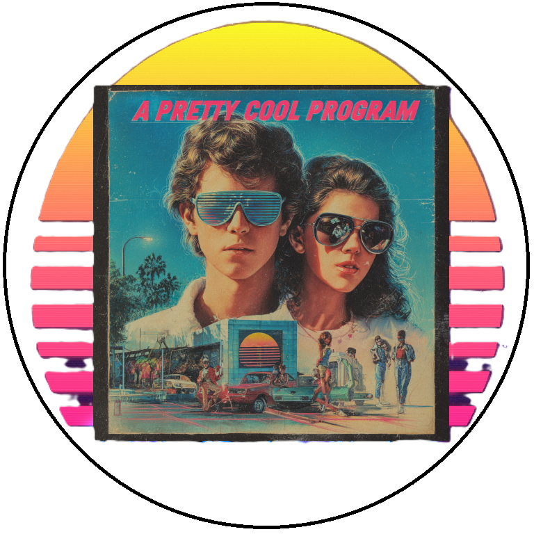

<!-- u250818 -->

  <picture>
    <source media="(prefers-color-scheme: dark)" srcset=".github/img/logo/apcp-logo-dark-768x768.png">
    <source media="(prefers-color-scheme: light)" srcset=".github/img/logo/apcp-logo-light-768x768.png">
    
  </picture>

 

***

 

* The [APCP Documentation Project](/docproj/README.md)