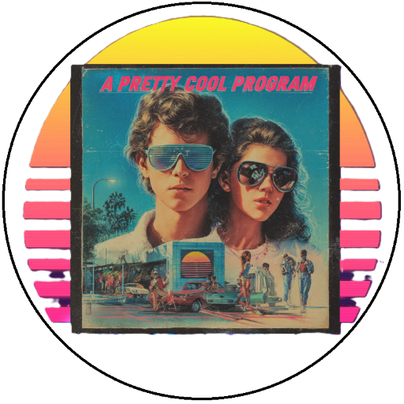

<!-- u250924 -->

# The APCP Documentation Project

  <picture>
    <source media="(prefers-color-scheme: dark)" srcset="../.github/img/logo/apcp-logo-dark-512x512.png">
    <source media="(prefers-color-scheme: light)" srcset="../.github/img/logo/apcp-logo-light-512x512.png">
    
  </picture>

 

***

# About

There will eventually be an about section here.

# Development

  * Nothing here yet.

# Documentation

* [Markdown](./documentation/markdown.md)
* [Mermaid.js](./documentation/mermaid-js.md)
* [XML Documentation (for C#)](./documentation/xml-csharp.md)

# How-To

* [Setup Microsoft IIS](./howto/setup-iis/README.md)
* [Setup Visual Studio 2022](./howto/setup-vs2022/README.md)

# Projects

# Repositories

# Source code
