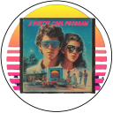

[[🏠︎](../README.md)]

<!-- u250924 -->

# The APCP Documentation Project

  <picture>
    <source media="(prefers-color-scheme: dark)" srcset="../.github/img/logo/apcp-logo-dark-128x128.png">
    <source media="(prefers-color-scheme: light)" srcset="../.github/img/logo/apcp-logo-light-128x128.png">
    
  </picture>

 

***

 

* [Setup Microsoft IIS](./howto/setup-iis/README.md)
* [Setup Visual Studio 2022](./howto/setup-vs2022/README.md)

 

***

[[🏠︎](../README.md)]