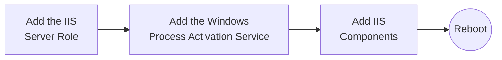
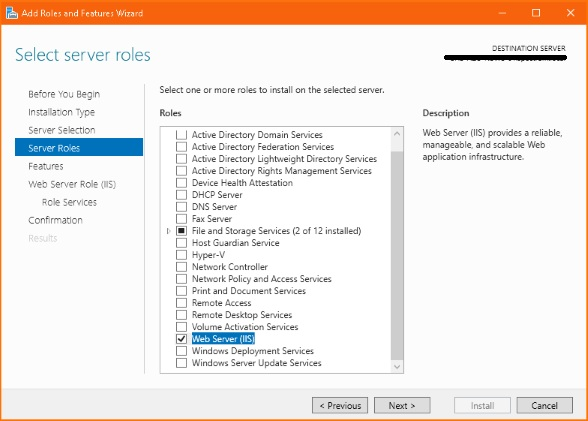
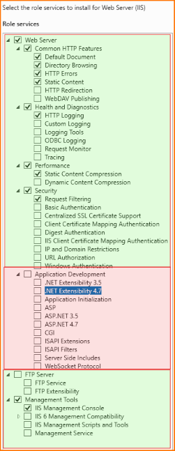
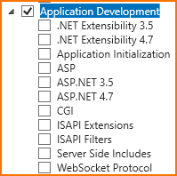
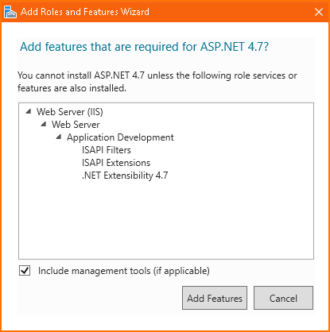
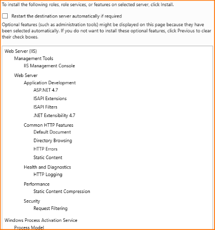

<!-- u251023 -->

[[🏠︎](../../README.md)]

***

### The APCP Documentation Project

  <picture>
    <source media="(prefers-color-scheme: dark)" srcset="../../../.github/img/logo/apcp-logo-dark-256x256.png">
    <source media="(prefers-color-scheme: light)" srcset="../../../.github/img/logo/apcp-logo-light-256x256.png">
    
  </picture>

# Installing Microsoft IIS for ASP applications

1. Launch the **Server Manager** application

2. Under **Server Roles**, check the box next to **Web Server (IIS)**

  

2. If a popup suggests you include the *IIS Mangement Console* tools, checked, then click ***Add Features***

  

3. Under **Features**, add the **Windows Process Activation Service**

  

4. Under **Web Server Role (IIS) > Role Services**, verify that the components highlighted green are set properly

  

4. Under **Web Server Role (IIS) > Role Services**, check **Application Development**

  

5. In the **Application Development** section, check the following *in this order*:

* **ISAPI Filters**
* **ISAPI Extensions**
* **.NET Extensibility 4.7**
* **ASP.NET 4.7**

  

> If you didn't follow the order above, you may get a popup letting you know that required features are missing. Just click ***Add Features***, and continue.

6. Click ***Next***, and you should see the confirmation screen:

  

7. Click ***Install***

8. Once the installation is complete, click ***Close***

## Reboot

If you checked the *Restart the destination server automatically if required* box on the confirmation screen, the server should reboot automatically.

If the server does not reboot automatically, reboot manually.

***

[[🏠︎](../../README.md)]
