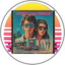

<!-- u250924 -->

[[🏠︎](/)]

# The APCP Documentation Project

  <picture>
    <source media="(prefers-color-scheme: dark)" srcset="../../.github/img/logo/apcp-logo-dark-128x128.png">
    <source media="(prefers-color-scheme: light)" srcset="../../.github/img/logo/apcp-logo-light-128x128.png">
    
  </picture>

  <h1>Sandcastle Help File Builder</h1>

## Contents

*[Visual Studio 2022 integration](./vs2022-integration/README.md)

***

[[🏠︎](/)]
